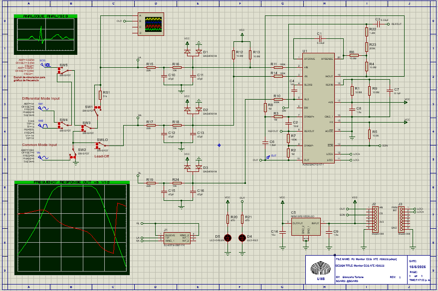
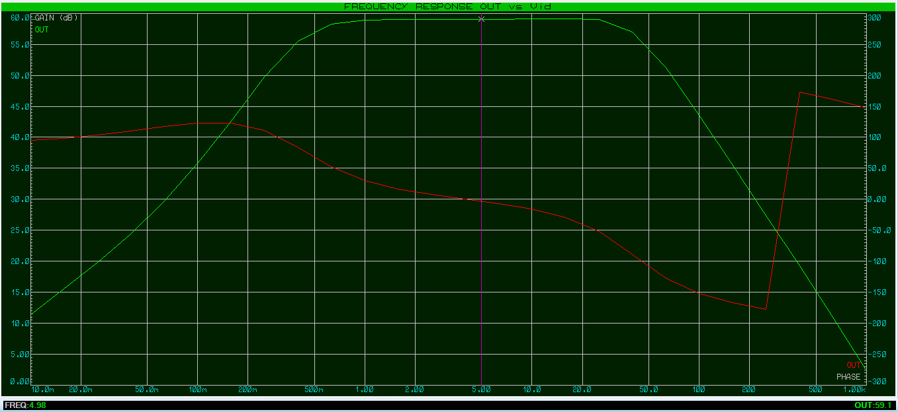
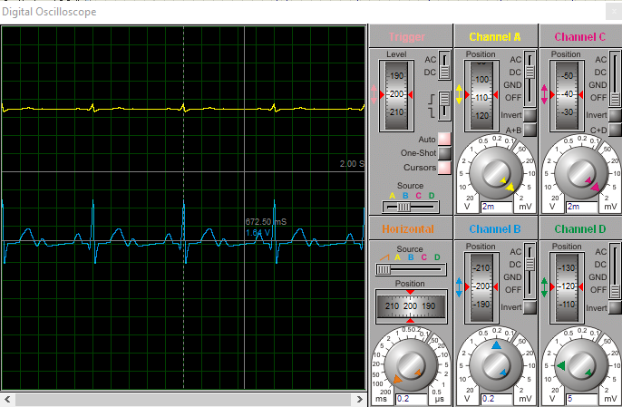

# ECG-Monitor-AD8232
Diseño de ECG (Electrocardiograma) basado en el AFE TI AD8232.

## 📚 Proyecto Académico
Proyecto desarrollado como parte de la asignatura EC3083 Taller de Equipos Electrónicos en la Universidad Simón Bolívar.

## 🛠️ Detalles Técnicos
- **Herramientas**: Proteus (esquemático + PCB).
- **Características clave**:
    - Monitor de frecuencia cardíaca analógico de una sola derivación (Single Lead).
    - Analog Front End (AFE) TI AD8232.
    - 2-layer PCB layout y modelo 3D.
    - BOM (Bill of Materials) completo con análisis de costo.

## 📸 Simulación

### Esquemático para simulación

### Bode de amplitud y fase de la ganancia modo diferencial

Caso pasa bajo: fc = 43.6 Hz

Caso pasa alto: fc = 0.445 Hz.

Avd = 59,1 dB frecuencias medias

### Vid (ECG simulado 0.625 mVp) y Vo (OUT)

## 📂 Documentación completa
Para un análisis teórico detallado descargar:
[Presentación PDF](/Documentos/Presentacion_ECG_Monitor_AFE_AD8232.pdf)

## ⚠️ Disclaimer
Esto es un diseño teórico. La fabricación de la PCB y sus pruebas están pendientes. 