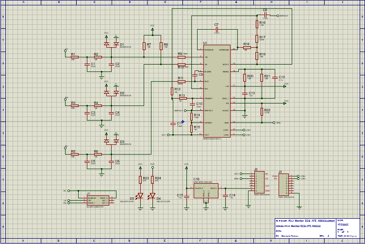
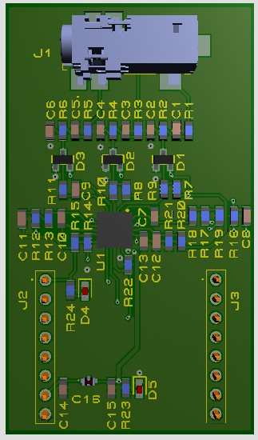
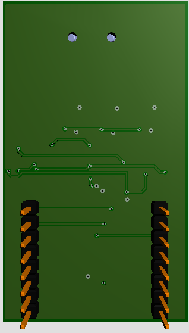
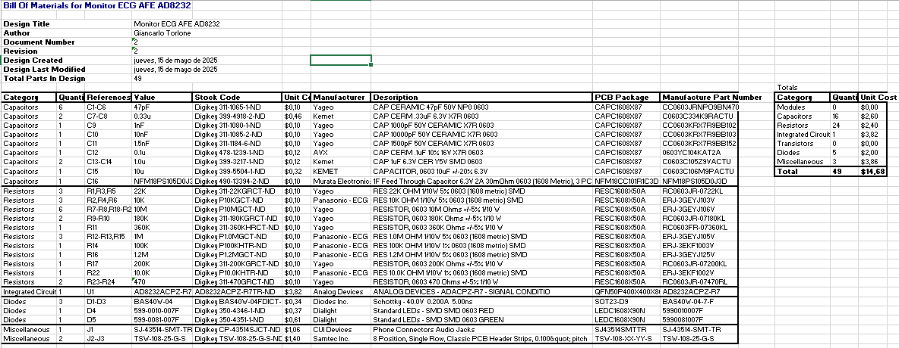

# ECG-Monitor-AD8232
Diseño de Monitor ECG (Electrocardiograma) de una sola derivación (Single Lead) basado en el AFE TI AD8232.

## 📚 Proyecto Académico
*Proyecto desarrollado como parte de la asignatura ***EC3083 Taller de Equipos Electrónicos*** en la Universidad Simón Bolívar.*

**Objetivo**: Diseñar un circuito ECG con esquemático, PCB layout y análisis teórico.

## 🛠️ Detalles Técnicos
- **Herramientas**:
    - **Proteus**: Esquemático, simulación y PCB.
- **Características clave**:
    - **Analog Front End (AFE)**: TI AD8232.
    - **Acondicionamiento de señal**: filtro pasabanda 0.445-43.6 Hz (simulado en Proteus).
    - **Ganancia media banda**: 59.1 dB (simulado en Proteus).
    - **Diseño PCB**: 2-layer layout.
    - **Bill of Materials (BOM)**: Lista de componentes completa con costos.

## 📸 Esquemático + PCB

## 📊 Simulación

### 📈 Bode de amplitud y fase de la ganancia modo diferencial

Caso pasa bajo: fc = 43.6 Hz

Caso pasa alto: fc = 0.445 Hz.

Avd = 59,1 dB frecuencias medias

### 📈 Vid (ECG simulado 0.625 mVp) y Vo (OUT)

## 📋 BOM (Bill of Materials)
[Descargar BOM](./Documentos/BOM_Monitor_ECG_AFE_AD8232.xlsx)

## 📂 Documentación completa
Para un análisis teórico detallado descargar:
[Presentación PDF](/Documentos/Presentacion_ECG_Monitor_AFE_AD8232.pdf)

## ⚠️ Disclaimer
Esto es un diseño teórico. La fabricación de la PCB y sus pruebas están pendientes. 